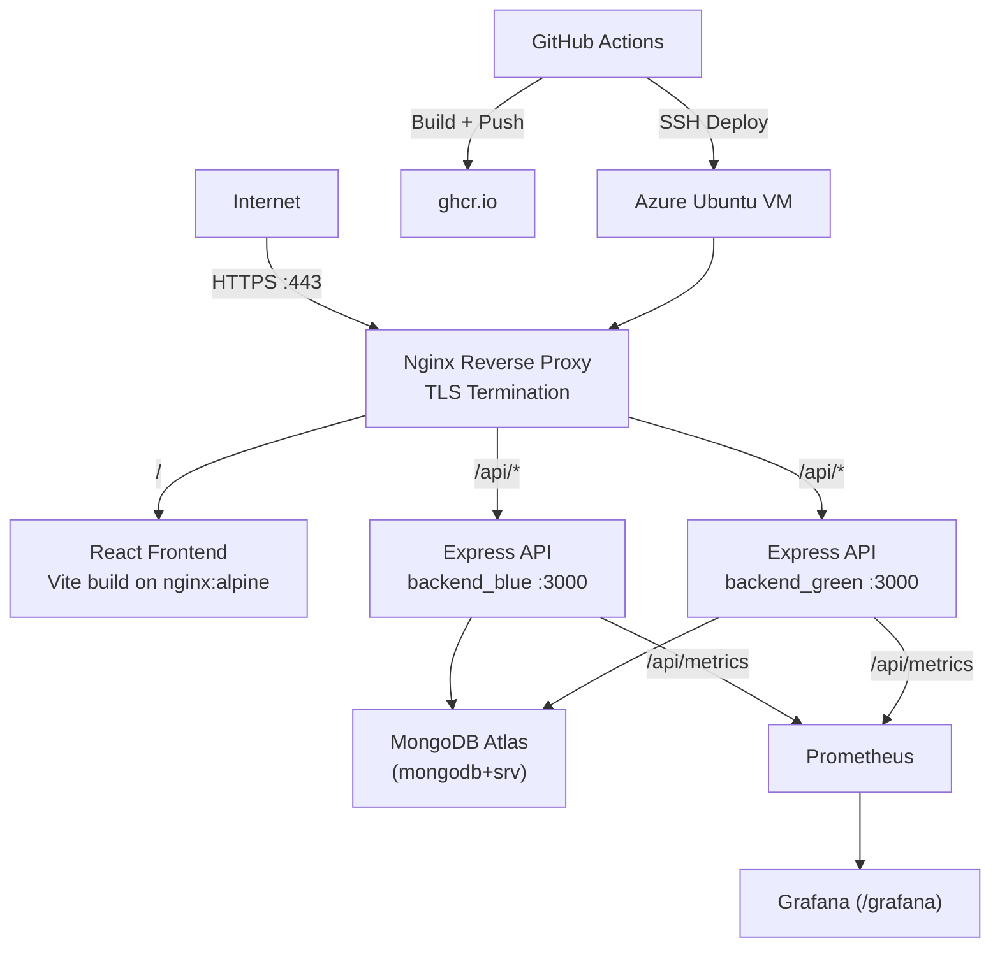

# QSL DevOps Engineer Practical Task

Production-style MERN stack deployment for `qtec.chishty.me` with containerization, reverse proxy, CI/CD, zero-downtime deployment, and observability.

## 1) System Architecture



## 2) Application Endpoints

- `GET /api/status`  
  Returns service health and metadata:
  - `status`
  - `version`
  - `uptime`
  - `timestamp`
  - `environment`
  - `color` (blue/green deployment slot)

- `POST /api/data`  
  Accepts JSON:

  ```json
  {
    "key": "environment",
    "value": "production"
  }
  ```

  Persists to MongoDB and returns created object.

- `GET /api/metrics`  
  Prometheus-compatible metrics endpoint.

## 3) Containerization Approach

- Multi-stage backend image in `backend/Dockerfile`
  - Runtime image uses non-root `node` user.
  - Health check probes `/api/status`.
- Multi-stage frontend image in `frontend/Dockerfile`
  - Vite builds static assets.
  - Nginx serves static files.
- `docker-compose.yml` defines:
  - `backend_blue`
  - `backend_green`
  - `frontend`
  - `nginx`
  - `prometheus`
  - `grafana`
- **MongoDB** is **MongoDB Atlas only** (`MONGODB_URI` in `.env`). No MongoDB container is included.

See [docs/ATLAS_PORT80_AND_GITHUB_SECRETS.md](docs/ATLAS_PORT80_AND_GITHUB_SECRETS.md) for Atlas IP allowlist, freeing port 80, and GitHub secrets.

## 4) Reverse Proxy and Traffic Management

Nginx configuration:

- Domain: `qtec.chishty.me`
- HTTP to HTTPS redirect
- TLS cert path: `/etc/letsencrypt/live/qtec.chishty.me/`
- Routing:
  - `/` -> frontend container
  - `/api/` -> backend upstream
  - `/grafana/` -> grafana container
- Load balancing:
  - `least_conn` upstream strategy
- Traffic controls:
  - `limit_req_zone` at `100r/s` with burst `200`
- Security headers:
  - `X-Frame-Options`
  - `X-Content-Type-Options`
  - `HSTS`

## 5) CI/CD Pipeline

Pipeline file: `.github/workflows/ci-cd.yml`

- **Pull requests** to `main`: runs **tests only** (no image push, no deploy).
- **Push** to `main`: tests → build/push images → deploy.

### Stages

1. **Test**
   - `npm ci` + Jest + Supertest (uses `backend/package-lock.json`).

2. **Build & Push**
   - Logs in to GHCR with the workflow **`GITHUB_TOKEN`** (no personal PAT required).
   - Image names use your GitHub owner in **lowercase** (required by GHCR).
   - Push both images to `ghcr.io/<owner>/qtec-backend` and `qtec-frontend` tagged with:
     - commit SHA
     - `latest`

3. **Deploy**
   - SSH to Azure VM.
   - Updates `.env` with `IMAGE_TAG` (SHA) and **lowercase** `GITHUB_OWNER`.
   - Runs `scripts/deploy.sh`.

### GitHub repository secrets (deploy only)

Configure under **Settings → Secrets and variables → Actions**:

| Secret | Required |
|--------|----------|
| `SSH_PRIVATE_KEY` | Yes (full private key for VM SSH) |
| `SERVER_IP` | Yes |
| `SERVER_USER` | Yes |
| `DEPLOY_PATH` | No — absolute path on the VM where the repo is cloned. Defaults to `/opt/qtec` if unset. Example: `/home/azureuser/project/devops-dashboard/devops-dash` |

You do **not** need `GHCR_TOKEN`; the workflow uses built-in `permissions: packages: write`.

### First-time GitHub push

```bash
git init
git add .
git commit -m "Initial commit"
git branch -M main
git remote add origin https://github.com/<you>/<repo>.git
git push -u origin main
```

Ensure **Settings → Actions → General** allows workflows, and for private repos that **Actions** can read the repo.

## 6) Zero-Downtime Deployment

`scripts/deploy.sh` uses blue-green rollout:

1. Detect current active color from `.active_color` in the project root (same directory as `docker-compose.yml`).
2. Select inactive color for new release.
3. Pull and start inactive backend container.
4. Wait until health check passes on `/api/status`.
5. Rewrite Nginx upstream to point to new color only.
6. Gracefully reload Nginx.
7. Stop old backend container.
8. Persist new active color.

This prevents interruption during deployment because traffic switches only after health success.

## 7) Logging and Monitoring Setup

### Logs

- Application logs: Winston JSON logs from backend.
- Request logs: Morgan access logs routed through Winston.
- Proxy logs: Nginx access/error logs.
- Container logs: via `docker compose logs`.

### Monitoring

- Prometheus scrape targets:
  - `backend_blue:3000/api/metrics`
  - `backend_green:3000/api/metrics`
- Grafana pre-provisioned with:
  - datasource: Prometheus
  - dashboard: API RPS, p95 latency, error ratio, heap usage

## 8) How the System Handles ~100 Requests/sec

The stack supports ~100 RPS through layered controls:

- Nginx reverse proxy optimized with:
  - `worker_processes auto`
  - `worker_connections 2048`
  - keepalive upstream connections
- Two backend slots (blue/green); both can run and serve traffic.
- Node.js async request handling and pooled MongoDB connections.
- API rate limiting at edge (`100r/s`, burst `200`) prevents abuse spikes.
- Lightweight endpoint logic and JSON payload handling.

For formal evidence, run load tests (e.g. k6/hey/wrk) against:

`https://qtec.chishty.me/api/status`

## 9) Local Development

```bash
cp .env.example .env
docker compose up -d --build
```

Test API:

```bash
curl http://localhost/api/status
curl -X POST http://localhost/api/data -H "Content-Type: application/json" -d '{"key":"sample","value":"123"}'
```

## 10) Cloud Deployment on Azure VM

1. Add DNS A record:
   - host: `qtec`
   - value: `<Azure VM Public IP>`
2. Install cert:

```bash
sudo certbot certonly --standalone -d qtec.chishty.me
```

3. Clone the repo to a fixed path on the VM (e.g. `/opt/qtec` or `~/project/.../devops-dash`). If you do not use `/opt/qtec`, set GitHub secret **`DEPLOY_PATH`** to that absolute path.
4. Configure `.env`.
5. Run:

```bash
chmod +x scripts/deploy.sh
./scripts/deploy.sh
```

## 11) Optional Bonus Assets Included

- Kubernetes manifests in `k8s/`
  - backend deployment
  - frontend deployment
  - mongodb statefulset
  - services
  - ingress
  - HPA
- Terraform in `terraform/`
  - Resource group
  - VNet + subnet
  - NSG (22/80/443)
  - Ubuntu VM + public IP
